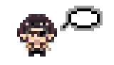

# MajimaVpet

A tiny pixel-art Majima that lives on your macOS desktop. He idles and wanders when you're still, dances when you move the mouse, chats along while you type, and reacts when you pick him up.

<p>
  
  
  
  
  
  
  
</p>

## Behaviour

| Category | Animations | Trigger |
|---|---|---|
| **Steady** | idle, walk | Cursor still for 1.5s: idles and takes short walks (20–40px) in any direction, bouncing off screen edges |
| **Interactive** | shock → confuse | Drag him anywhere on screen: "!" while held, "?" after you drop him |
| **Showtime** | change → dance | Cursor moving: sparkle entrance, then dances until the cursor stops |
| **Typing** | typing | Keyboard in use: a speech bubble fills with "…" until you stop typing (0.5s) |

The pet window floats above other windows and stays in the same spot on every desktop (Space), including full-screen apps and Mission Control. Clicks pass through its transparent areas.

## Menu bar

Click the little Majima icon in the menu bar:

- **Hide / Show Majima** (⌘H)
- **Pause / Resume** (⌘P): freezes the animation
- **Quit MajimaVpet** (⌘Q)

> On macOS 26+, if the icon doesn't appear, enable the app under **System Settings → Menu Bar → Allow in the Menu Bar**.

## Setup

Requires macOS and Python 3.

```bash
python3 -m venv program/venv
program/venv/bin/pip install -r program/requirements.txt
```

## Run

Double-click `MajimaVpet.app`, or from a terminal:

```bash
program/venv/bin/python program/vpet_mac.py
```

## Tweaks

Settings at the top of `program/vpet_mac.py`:

| Setting | Default | Meaning |
|---|---|---|
| `scale` | `1` | Sprite scale (nearest-neighbour, stays crisp) |
| `still_after` | `1.5` | Seconds of cursor stillness before leaving Showtime |
| `walk_speed` | `1` | Pixels per tick while walking |
| `walk_loops` | `(1, 2)` | Walk cycles per stroll (~20px each) |
| `dropped_loops` | `2` | Times the "?" plays after a drop |
| `typing_after` | `0.5` | Seconds after the last key press that still count as typing |

## Project layout

```
MajimaVpet.app/        macOS launcher bundle (runs program/vpet_mac.py with the venv)
program/vpet_mac.py    the pet: Cocoa window, animation state machine, menu bar item
majima-*.gif           sprite animations (80×92; typing is 160×92)
```
